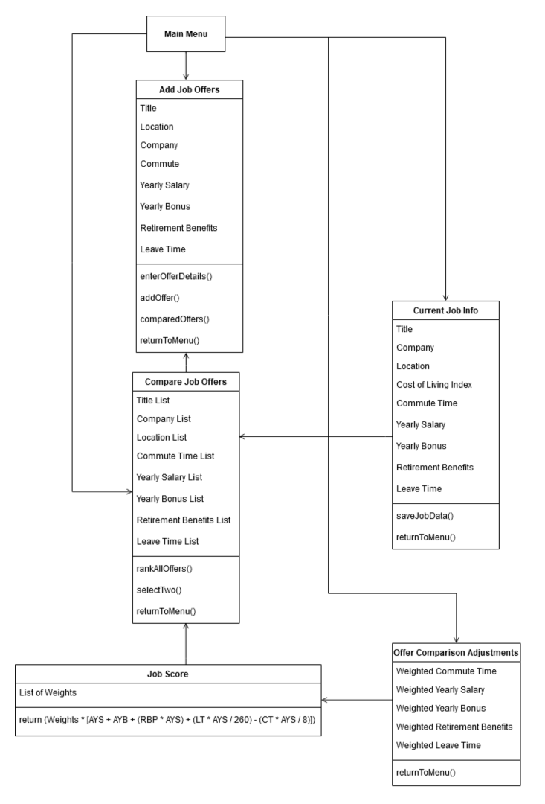
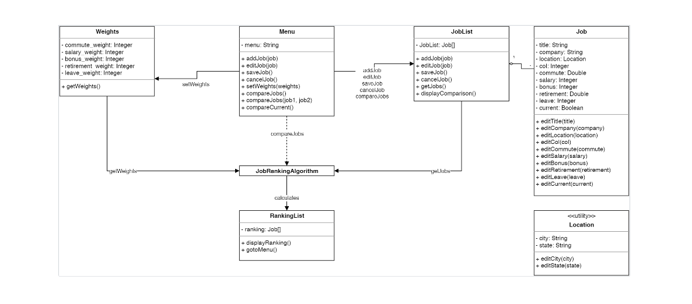
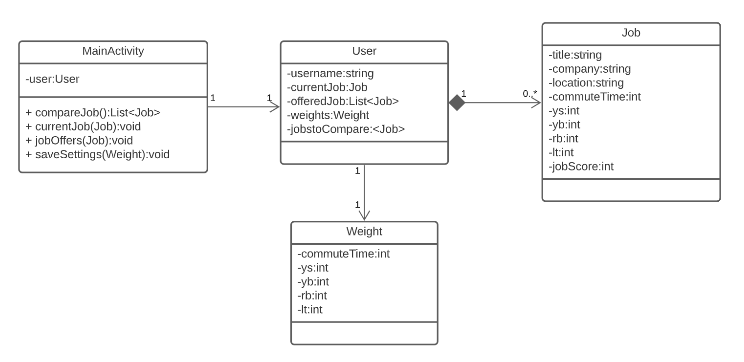
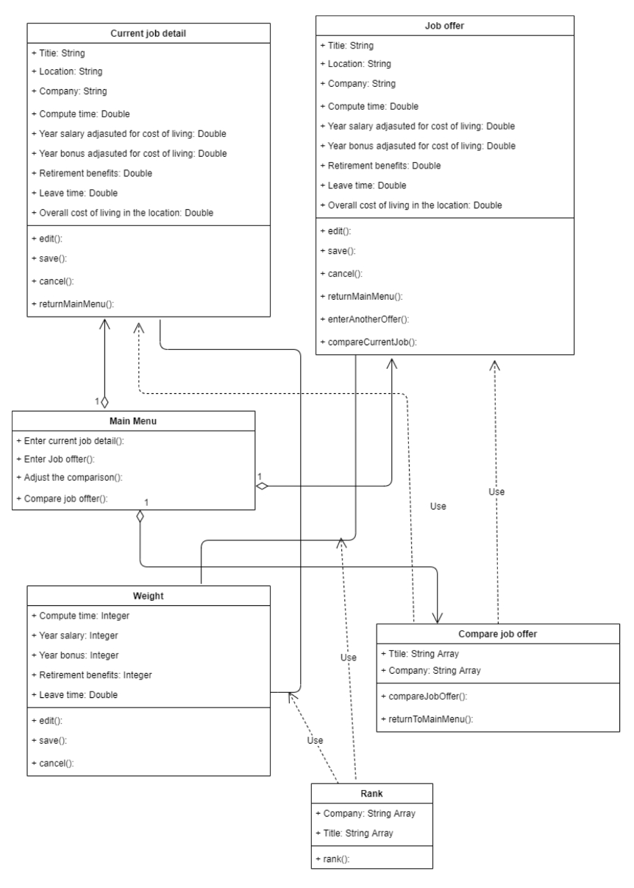

# Design Discussion  

## Design 1  
  
Pros  
- Appears to clearly cover all the requirements and needs of the app
- Clear and logical relationship flow from each class to other classes
- Covers all the UI interactions that would be expected from the app
- Very straightforward and simple design

Cons  
- Could add more clarity on what the attribute types are expected to be
- In the Job Score function, should clarify what the abbreviations mean
- Could list what parameters the Job Score class accepts
- Could add more relationships between the classes like association or aggregation

## Design 2  
  
Pros  
- All attributes for each class are covered in good detail 
- Good design that shows different kinds of relationships between classes
- Data types added behind each attribute

Cons  
- Does not necessarily need to show the operators that modify the attributes, too much detail can clutter the design

## Design 3  
  
Pros  
- Good detail on specifying what data type is expected for each attribute
- Adds detail on whether attributes or operations should be public or private

Cons  
- A little unclear on where the job ranking algorithm lives (which operation?)
- On the UML diagram level, consider spelling out variable names so they are unambiguous

## Design 4  
  
Pros  
- Very extensive and detailed documentation of the relationships from one class to another
- Clearly defined operations like rankAllOffers() and selectTwo() that help me identify that this design satisfies the requirements of the app
- Shows the full implementation and is very detailed

Cons  
- Can the design be simplified by making generalizing the "Current Job Detail" class as an attribute or subclass of "Job Offer"?
- The "Job Score" class needs to grab information from the "Add Job Offers" and/or "Current Job Info" class right? Are we capturing that relationship?

## Team Design  

Commonalities  
- Most of the team's individual designs had a designated "menu" class, showing that the design was created with the GUI in mind
- All the designs defined a "job" or a "job offer" as its own class instance with the same attributes
- All the designs defined immediate relationships between the "main" or "menu" class and the "ranking weights" and the ""job classes

Differences  
- Not all the designs decided to go into detail on the ranking algorithm to be used in implementation within the design
- Some designs had a high degree of interconnectivity between the different classes while others had a more "top-down" hierarchal design
- Some designs considered how the implementation of the GUI might go, with operators such as gotoMenu() or returntoMenu() while other designs did not consider it

## Summary  
One of the valuable lessons learned in this exercise was that there is no definitive or "absolute right way" to construct a UML diagram. Software design is as much an art as it is a science, and the design of even a relatively simple app such as this can be affected significantly by user preferences and biases. When examining the different designs as a team, the team was able to quickly come to a consensus on which designs they wanted to further refine. Each team member then did further refinements of the selected original design and the best refinements of each individual made it into the final team design after a brief discussion. Regardless of user preference, something the team was able to come to agreement on is that simplification of the design when it did not compromise the fidelity or function was desirable. A key example of this was consolidating the "Current Job" and "Job Offer" classes that many of the individual designs defined into a singular "Job" class that denoted whether it was the current job or a job offer through a boolean attribute. Another example was combining the intended ranking and job comparison functionality into a single operator, where the intended function is defined by the number of parameters passed into the operator. The team learned that while complex designs are definitely needed for complex software projects, simplifying a UML diagram without compromising functionality results in a much clearer design direction and improves how easily the software design can be understood.