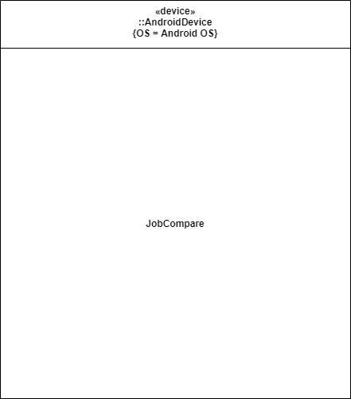
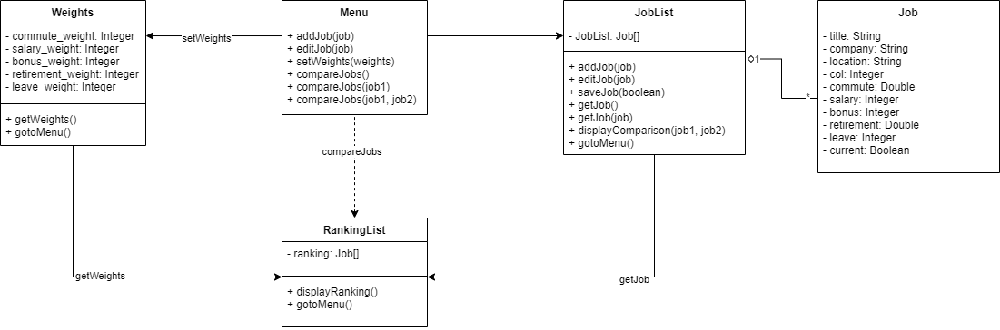
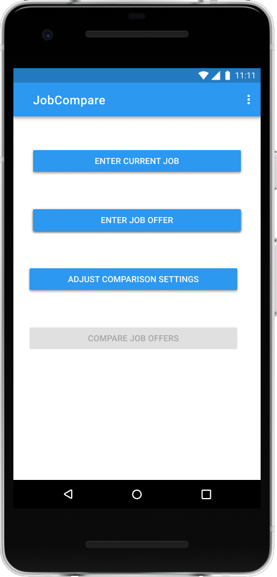
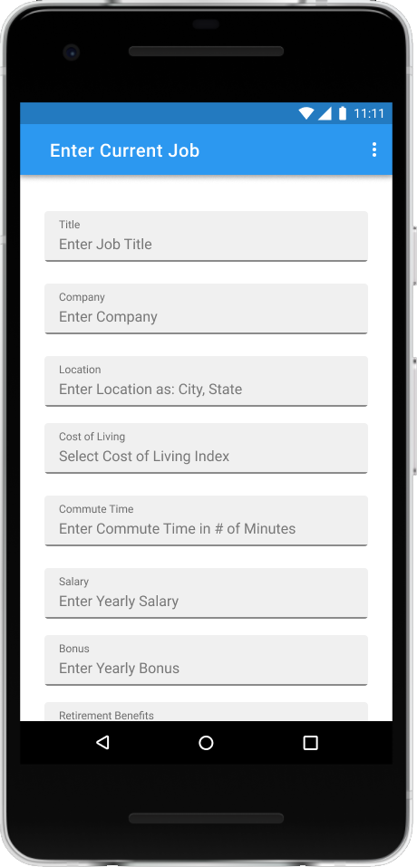
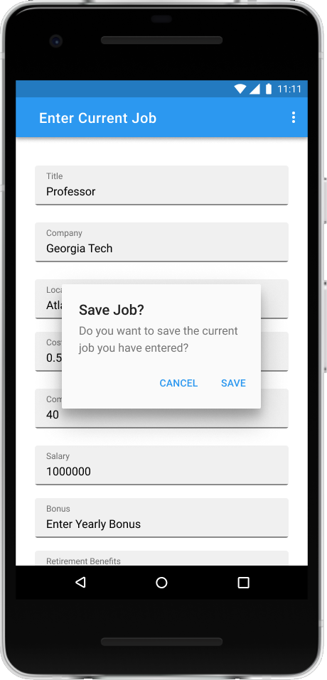

# Design Document

*This is the template for your design document. The parts in italics are concise explanations of what should go in the corresponding sections and should not appear in the final document.*

**Author**: Jason Wong

## 1 Design Considerations

*The subsections below describe the issues that need to be addressed or resolved prior to or while completing the design, as well as issues that may influence the design process.*

### 1.1 Assumptions

*Describe any assumption, background, or dependencies of the software, its use, the operational environment, or significant project issues.*  
#### 1.1.1 Assumptions
* The JobCompare app is only intended to run on Android devices.
* The JobCompare app needs only to be compatible with versions of Android as recommended or specified by the default Android Studio settings.
* The JobCompare app does not require any sign-in, log-in, or external dependencies and will be a fully self-contained app as specified by the app requirements.
* Users of the app are intended to be using the app on an Android device platform, not through an Android emulator or other hardware platform.
* Users of the app are assumed to have access to standard Android device input and output functions (e.g. touchscreen, on-screen keyboard, etc).
* The JobCompare app need not include specific accessibility functionality other than default accessibility options built-in to the Android operating system.
* Users of the app are assumed to interact with the app in a manual fashion, as opposed to an automated fashion.
* Use of the app is assumed to be limited to a user entering no more than several dozen job offers and the app need not include functionality to improve usability for hundreds of job offers being entered.
* Use of the app is assumed to be limited to a reasonable scale such that the app will not experience errors due to type overflows.
* Distribution of the app is not included within the scope of the requirements and the process of uploading and distributing the app via the Google Play Store or other distribution channels is not within the scope of this project.
* Sideloading the JobCompare app via an .apk is an acceptable passing criteria for the distribution of this app.

#### 1.1.2 Background
The background of this app is the request of a fellow classmate, George P. Burdell, who is requesting the team develop a simple Android app that will allow him to compare different job offers. Beyond the requirements provided by Mr. Burdell, there are no other expected constraints or requirements that may affect the scope of the project.

#### 1.1.3 Dependencies
* A functional Android device with standard input and output modalities.
* A functional Android device running a Android OS version compatible with that of the JobCompare app.
* An accessible method to allow the JobCompare app to be loaded and installed on the functional Android device mentioned above.

### 1.2 Constraints

*Describe any constraints on the system that have a significant impact on the design of the system.*  
* The system is specified to be an Android app, which limits available testing platforms and the technology stack that the team can utilize. Because the system is an Android app, the system will be designed in the Android Studio environment using Java whereas an unconstrained system might be able to use React, Electron, Swift, or other programming languages or frameworks.
* The app requirements state that the ranking and comparison of jobs is to be displayed via the user interface. This prevents the ranking or output of the app to be simply exported to a .json file or similar export file for later consumption.
* The app requirements provide rigid, set fields and metrics to compare job offers. This constrains the design of the system from properly comparing aspects of job offers such as company equity, health insurance, or other aspects of compensation that would be relevant for comparing job offers.
* The app requirements provide a specific user flow that the app must conform to (e.g. when being presented with the main menu, the user should see the following options...) Design of how the system might dictate user flow is constrained here.
* The app requirements provide the algorithm that should be used to rank and compare jobs. This constrains the design of the system in that the system cannot elect to compare or rank jobs in another way that the developers might find to be more accurate or suitable.

### 1.3 System Environment

*Describe the hardware and software that the system must operate in and interact with.*  
The hardware that the system must operate with is the Android device that the app will be run on. For testing purposes, the system may also operate in Android Studio on a personal computer running either the Windows, Mac, Linux, or Chrome OS operating systems. The software that the system must interact with is the Android OS that will be running on the Android device or in the emulator on Android studio. Because Android typically sandboxes apps, the system is not expected to have to interact with other software.

## 2 Architectural Design

*The architecture provides the high-level design view of a system and provides a basis for more detailed design work. These subsections describe the top-level components of the system you are building and their relationships.*

### 2.1 Component Diagram

*This section should provide and describe a diagram that shows the various components and how they are connected. This diagram shows the logical/functional components of the system, where each component represents a cluster of related functionality. In the case of simple systems, where there is a single component, this diagram may be unnecessary; in these cases, simply state so and concisely state why.*

### 2.2 Deployment Diagram

*This section should describe how the different components will be deployed on actual hardware devices. Similar to the previous subsection, this diagram may be unnecessary for simple systems; in these cases, simply state so and concisely state why.*  
A deployment diagram is not strictly necessary because this system is a simple system. The only device that this system will be deployed on is an Android device and there are no external interfaces to other devices. A representative deployment diagram can be seen below.  
 

## 3 Low-Level Design

*Describe the low-level design for each of the system components identified in the previous section. For each component, you should provide details in the following UML diagrams to show its internal structure.*

### 3.1 Class Diagram

*In the case of an OO design, the internal structure of a software component would typically be expressed as a UML class diagram that represents the static class structure for the component and their relationships.*  
The system will be utilizing an OO design with the internal structure of the software components expressed in a UML class diagram. The different software components and their relationships can be seen in the following UML class diagram.
 

### 3.2 Other Diagrams

*<u>Optionally</u>, you can decide to describe some dynamic aspects of your system using one or more behavioral diagrams, such as sequence and state diagrams.*

## 4 User Interface Design
*For GUI-based systems, this section should provide the specific format/layout of the user interface of the system (e.g., in the form of graphical mockups).*  
The system is a GUI-based system that will rely on the user interacting with a user interface in order to achieve its desired functions. The following graphical mockups below show how a user might interact with and use the system.  

**Main Menu**  
  

**Entering Current Job**  

**Confirming Current Job**  
  