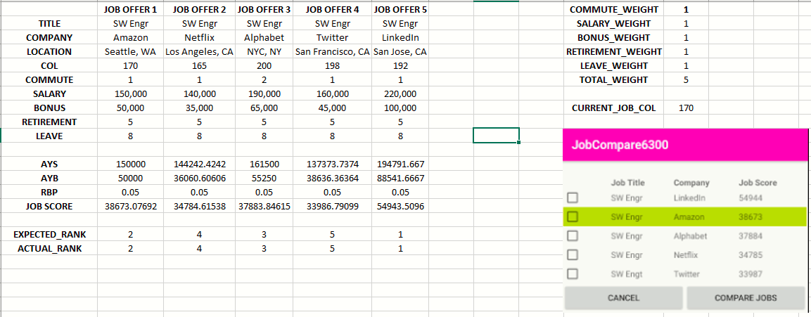
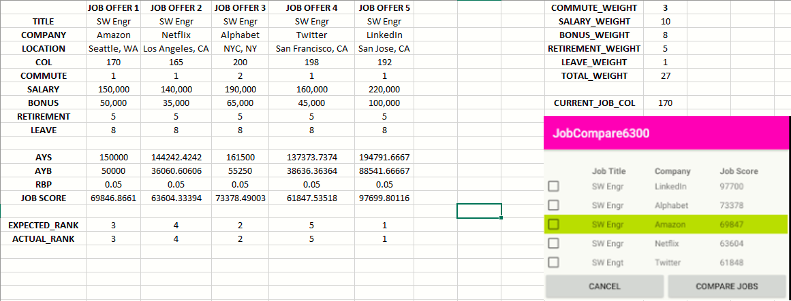
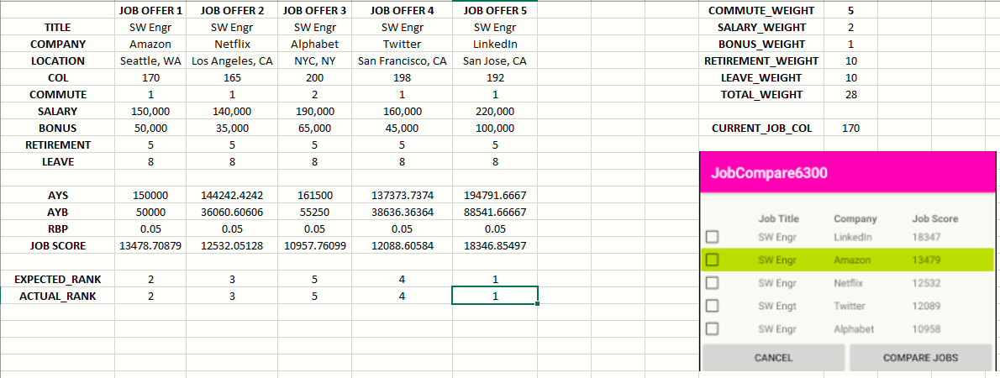

# Test Plan

**Author**: Shu Liu, Fadi Habashy (Team 120)

## 1 Testing Strategy

### 1.1 Overall strategy

Unit Tests  
There will be a unit test for each class individually. The unit test will be performed by the main tester in our group. After each activity is built, it will be passed to the main tester to test with a few inputs to check the functionality. These tests should not be very complex. More complex testing will be implemented in the integration part. The unit tests should ensure that each class works as expected so we can commit to Continuous integration/continuous development.

Integration Tests  
Most of the integration tests will be performed mainly by the main tester, and some of the tests will be performed by the developers. In the UML diagram, we have five classes for our job offer app. The integration test will focus on testing the interaction among different activities. For example, it should test out the relation between job and joblist class, as well as the interaction between weights and ranking list. These tests should be more complex than the unit test, but should test no more than three classes at a time.

System Tests  
System tests should test the full functionality of the entire system and are to be performed by the Main Tester. The system tests should focus on how to edit the current job, create the joblist and compare different jobs together to ensure that Mr. Burdell (and other future users) have a good user experience with the app. Some of the test cases might be a bit too complex and require the attention and collaboration of the entire team.

Regression Tests  
Regression tests should be performed by the Main Tester. After the bugs found in the integration and system tests are fixed, old inputs should be tested once again to verify the actual results and expected results are matching. Since unit tests will test every single method in the app, it's important that fixing a specific bug doesn't create more bugs elsewhere. 

### 1.2 Test Selection
All unit tests will use white-box testing because our main focus is on testing the basic functionality of each individual class. The integration tests will also use white-box testing to test the interactions between several classes. Lastly, the system tests will use both white-box and black-box techniques to test the entire functionality of the app.

### 1.3 Adequacy Criterion
The test cases will be evaluated on how well they fulfill the requirements of the app. They must be consistent with DesignDocument.md and ExtraRequirements.md.

### 1.4 Bug Tracking
Bugs will be reported on the Slack group page so that group members can discuss and formulate sturdy solutions to each problem. 
Request enhancement can be done in a similar manner. After the initial design is completed, we will gather all suggestions to produce a more refined and stable version of the app. 

### 1.5 Technology
The majority of the test cases will be conducted manually. Screenshots are provided below to demonstrate proper functionality:

#### Test Case 1

#### Test Case 2

#### Test Case 3
 

## 2 Test Cases
| Purpose                     | Steps                                                                                             | Expected                                          | Actual                             | P/F |
| --------------------------- | ------------------------------------------------------------------------------------------------- | ------------------------------------------------- | ---------------------------------- | --- |
| Test Adding Current Job     | Click "Add/Edit Current Job" in the main menu, input all the information of current job           | Current job is added                              | Current job is added           | P   |
| Test Canceling Current Job  | Click "Add/Edit Current Job" in the main menu, input all new information of current job           | Current job is not saved or edited                | Current job is not saved or edited | P   |
| Test Editing Current Job    | Click "Add/Edit Current Job" in the main menu, input all new information of current job           | Current job is edited                             | Current job is edited          | P  |
| Test Adding Job Offer       | Click "Add Job Offer" in the main menu, all the information of job offer                          | Job offer is added                                | Job offer is added             | P   |
| Test Cancelling Job Offer   | Click "Add Job Offer" in the main menu, all the information of job offer                          | Job offer is not saved or edited                  | Job offer is not saved or edited   | P   |
| Test Saving Weights         | Click "Adjust Ranking Weights" in the main menu , input the weight info, click "Save"             | Weights are saved                                 | Weight are saved                   | P   |
| Test Cancelling Weight      | Click "Adjust Ranking Weights" in the main menu , input the weight info, click "Cancel"           | Weights are not saved                             | Weight are not saved               | P   |
| Test Returning to Menu      | Click "Cancel" or "Save" while in various activity menus                                          | App returns to menu                               | App returns to menu                | P   |
| Test Comparing Current Job  | Click "Save and Compare with Current" after entering job offer info in the "Add Job Offer" screen | Table is shown comparing entered and current jobs | Table is shown comparing entered and current jobs          | P   |
| Test Comparing Two Jobs     | Select two jobs in the "Rank Job Offers" screen and click "Compare Jobs"                          | Table is shown comparing selected jobs            | Table is shown comparing selected jobs          | P   |
| Test Ranking Jobs Algorithm | Click "Rank Job Offers" in the main menu                                                          | Table is shown ranking all jobs                   | Table is shown ranking all jobs          | P   |
| Test App State Persistence  | Perform other test cases, close the app, then reopen to see if the app state persists             | App state persists                                | App state persists        | P   |

## Results
The following images show several input 