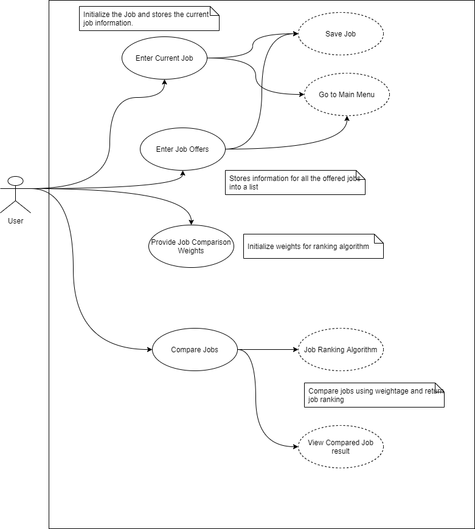

# Use Case Model

The following use case diagram is based on the requirement provided for job comparison application. 

**Author**: Team120

## 1 Use Case Diagram

 

## 2 Use Case Descriptions

 #### 1. Enter Current Job
 Requirement : This use case will allow user to enter current job details and let user either save the information or cancel and go back to main menu.
 Pre-Condition : User must already have started the application
 Post-Condition : User must enter all the job details and select action to save or cancel
 Scenario : Normal

 #### 2. Enter Job Offers
 Requirement : Allow user to enter job offers for comparison. 
 Pre-Condition : User must already have started the application
 Post-Condition : User must enter all the job details and select action to save or cancel. 
 Scenario : Normal

#### 3. Enter Weights
 Requirement : Let user set the weights for job comparison. 
 Pre-Condition : User must already have started the application
 Post-Condition : weights either should have values entered by user or default equal values for all weight. 
 Scenario : Normal

#### 4. Compare Jobs
 Requirement : User can select different job offers and compare between offers or with current job.
 Pre-Condition : Current Job details and/or Job offers must have been saved.
 Post-Condition : Job ranking algorithm will provide ranks for each job. 
 Scenario : Normal